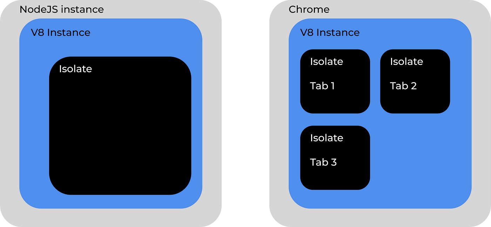

What is V8?

V8 is an engine which executes JavaScript code. In other words V8 is a compiler which takes JavaScript,
compiles it to C, then executes it. V8 is embedded in the browser so that JavaScript can be run in the broswer.
However you cannot run JavaScript on your local machine without downloading V8. Most commonly this is done
through downloading Node which has V8 embedded. So because V8 is embedded in the broswer and in Node you can
run JavaScript in both places.

What can V8 do alone? How is JavaScript extended with runtimes like Node?


`01_execute_plain_javascript.rs`

``` rust
use rusty_v8 as v8; 

fn main(){

//INITIALIZE V8
let platform = v8::new_default_platform(0, false).make_shared();
v8::V8::initialize_platform(platform);
v8::V8::initialize();

let isolate = &mut v8::Isolate::new(Default::default()); 
let handle_scope = &mut v8::HandleScope::new(isolate);
let context: v8::Local<v8::Context> = v8::Context::new(handle_scope);
let scope = &mut v8::ContextScope::new(handle_scope, context);

//READ FILE 
let filepath: &str = "foo.js"; 
let file_contents = match read_file(filepath){
    Ok(contents) => contents, 
    Err (e) => {
        eprintln!("ERROR: {}", e);
        return; 
    }
};

//EXECUTE CODE
let code = v8::String::new(scope, &file_contents).unwrap(); 
let script = v8::Script::compile(scope, code, None).unwrap();
let result = script.run(scope).unwrap();
let result = result.to_string(scope).unwrap();
println!("Results: {}", result.to_rust_string_lossy(scope));

}
```

This example is uses `rusty\_v8` the rust bindings of V8.

### One to Many: Platforms, Isolates, and Contexts 

1. **Platform**
   The V8 platform is the interface that manages operating system-level resources such as threads and tasks. It provides the execution environment for isolates to run.

2. **Isolate**
   An isolate is an independent instance of the V8 engine, where JavaScript code is executed. Each isolate has its own heap, and objects within one isolate are not accessible from another, providing isolation between different executions.

3. **Context**
   A context is an execution environment within an isolate. It holds the global object. This global holds associated variables, functions, and objects. Each context is separate from other contexts within the same isolate, meaning they have distinct global states and do not share variables or functions.


Explictly stated from the diagram above. One platform can have multiple isolates. One isolate can have mutliple contexts. Note that each isolate may only ever have a single 
active context. Although one context may be switch from one to another through "entering context scope" which will be refered to later. The important idea, in the case of 
using V8 to create a JavaScript runtime, is that Node primarly deals with a single isolate in a single context. Nevertheless it is interesting to keep this idea in mind as 
reference. For example one application in the broswer is spinning up an isolate for each tab. 


Note this diagram is taken from Felipe Mantilla on his Medium aritcle linked [here](https://medium.com/@felipemantillagomez/recreating-nodejs-from-scratch-chapter-3-v8-hello-world-main-concepts-explained-58d58676db36)

### V8 Bridge: JavaScript <---> Rust 

There is a bijection between JavaScript, as provided via V8 handles, and Rust. This means any code written in JavaScript can be transformed into code which can be manipulated 
by Rust. This also goes in the other direction. Any code written in Rust can be transformed in to code which can be manipulated by JavaScript. There are caveuats however this 
is the correct mental model for working with V8. Within the code snippet above we instances of converting strings in both directions.  


##### Rust ---> JavaScript 
Lets take a deeper look into the code below: 

```rust 
let filepath: &str = "foo.js"; 
let file_contents = match read_file(filepath){
    Ok(contents) => contents, 
    Err (e) => {
        eprintln!("ERROR: {}", e);
        return; 
    }
};

let code: v8::Local<v8::String> = v8::String::new(scope, &file_contents).unwrap(); 

```

Firstly we read a small JavaScript file into a Rust `String`. Now with the file contents in this string we pass it into the static function provided by the v8 API callled 
`v8::String::new(scope: ContextScope, file_content: String)` to create a handle. This handle is of type `v8::Local<v8::String>` and stores a reference to both the string itself 
and the context in which it was created, hence `ContextScope` being one of the parameters. When the cleanup routine is initiated v8 will use this handle to track every instance 
in which JavaScript is stored and clear it from the heap.  


##### JavaScript ---> Rust 
Lets now explore the other direction. Suppose foo.js is a script which returns a JavaScript `String`. 

`foo.js`
```javascript
let greeting = "Hello World!";
greeting; 

```

The final line of this script is an expression which returns  `"Hello World!"`.  

With this in mind lets consider the code below: 

```rust 
let script = v8::Script::compile(scope, code, None).unwrap();
let value = script.run(scope).unwrap();
let result = value.to_string(scope).unwrap();
println!("Results: {}", result.to_rust_string_lossy(scope));

```

Firstly we compile the string containing the code into a `v8::Script` object. This script object is now run in order to produce a `v8::Value`. In this case our script will 
return a JavaScript String. Commonly, in other cases, the compiled script will return a JavaScript Object. Since the resulting value is a string it can be transformed into 
a `v8::Local<v8::String>`. Finally, with this local string handle we can call the method `to_rust_string_lossy` in order to convert into a Rust String. Observe that we have gone
from Script -> Value -> Local::String -> (Rust) String. Each of the methods: compile, run, to_string, and to_rust_string_lossy were associated with these transformations.    
Much of v8 programming, from my limited experience, feels like following these chains of transformations.

The concept of a bridge was inspired by Mayank Choubey's book [Deno Internals](https://choubey.gitbook.io/internals-of-deno). 

In the next article we will explore how to not just run JavaScript code but also extend it.