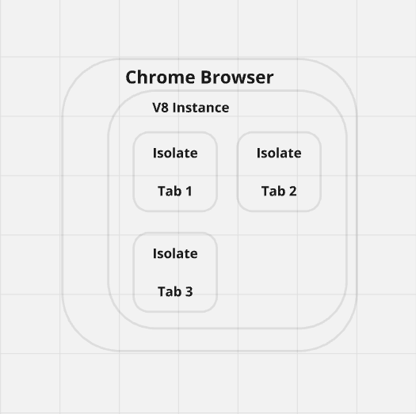
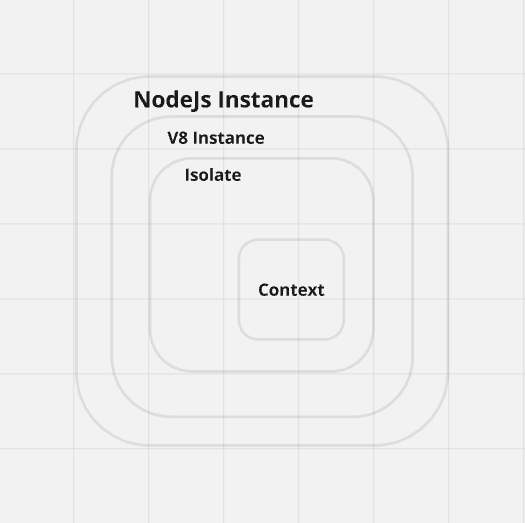

# Javascript Runtime from Scratch Part 1
By Hao Tran

### Preface 
This article will focus on the major V8 concepts which are involved in building a Javascript Runtime. Many of these concepts will be illustrated with diagrams 
in order to build mental models which aid in interpreting the V8 source code. My personal opinion is that these diagrams are easy to remember as broad concepts 
which encapsulate complex technical details. The structure of each article revolves around some main feature and the code which implements that feature and 
the main concepts associate with V8 in order to write that code. With that being said lets define what problem will be solved in the feature.   

My personal opinion is that these diagrams are easy to remember as broad concepts which encapsulate complex technical details. 

### Main Feature

The program which we will be analyzing today will solve the following problem. How to run a vanilla Javascript file within a program that contains an embedded V8 instance?  

Now lets take a look at the `foo.js` and `execute_vanilla_javascript.rs`.   

`foo.js`
``` Javascript 
let greeting = "Hello World!";
greeting; 

```
Note that when this file is executed the return value will be `"Hello World"`.

`execute_vanilla_javascript.rs`
``` rust
use rusty_v8 as v8; 

fn main(){

//INITIALIZE V8
let platform = v8::new_default_platform(0, false).make_shared();
v8::V8::initialize_platform(platform);
v8::V8::initialize();

let isolate = &mut v8::Isolate::new(Default::default()); 
let handle_scope = &mut v8::HandleScope::new(isolate);
let context: v8::Local<v8::Context> = v8::Context::new(handle_scope);
let scope = &mut v8::ContextScope::new(handle_scope, context);

//READ FILE 
let filepath: &str = "foo.js"; 
let file_contents = match read_file(filepath){
    Ok(contents) => contents, 
    Err (e) => {
        eprintln!("ERROR: {}", e);
        return; 
    }
};

//EXECUTE CODE
let code = v8::String::new(scope, &file_contents).unwrap(); 
let script = v8::Script::compile(scope, code, None).unwrap();
let result = script.run(scope).unwrap();
let result = result.to_string(scope).unwrap();
println!("Results: {}", result.to_rust_string_lossy(scope));

}
```

With the code being shown above, here are the main concepts which we will be exploring today. 

### Main Concepts 

1. **V8 Infrastructure: Platform, Isolate, Context** 
2. **V8 Bridge: Javascript <---> Rust**
3. **V8 Handles & Scopes**

The main concepts roughly map to the various sections of the program. V8 Infrastructure maps to the `//INITIALIZE V8` section. While the V8 Bridge and 
V8 Handles concepts maps to the `//READ FILE` and `//EXECUTE CODE` sections combined. You'll notice that the code below is written in Rust and draws from the `rusty_v8` 
library. This is due to the ease of embedding V8 in Rust applications which is a one line download. In contrast embedding in C++ programs requires an extensive process. 
If this is your first time reading Rust I encourage you to keep reading as the concepts, diagrams, and most of the writing will be language agonostic. 

## V8 Infrastructure: Platform, Isolate, and Context 

1. **Platform**
   The V8 platform is the interface that manages operating system-level resources such as threads and tasks. It provides the execution environment for isolates to run.

2. **Isolate**
   An isolate is an independent instance of the V8 engine, where Javascript code is executed. Each isolate has its own heap, and objects within one isolate are not accessible from another, providing isolation between different executions.

3. **Context**
   A context is an execution environment within an isolate. It holds the global object. This global holds associated variables, functions, and objects. Each context is separate from other contexts within the same isolate, meaning they have distinct global states and do not share variables or functions.

### One-to-Many Relationship


There is only ever a single instance of platform. But one platform can have multiple isolates and one isolate can have mutliple contexts. Note that each isolate may only have a single 
**active context**, although an isolate may may switch from one context to another through **entering context scope**. This will be refered to shortly in the handles and scopes main concept 
section. Although isolates and contexts are not often directly manipulated by the programmer beyond setup, the importance in understanding these various one-to-many relationships is to 
provide background for various program architectures which embed V8. Here are two examples of what this looks like in an application. 

### EX 1) Chrome 


Notice that Chrome pairs each tab with an isolate illustrating the developers intended use of spawing multiple isolates from a platform. 

### EX 2) Node 


Notice that Node has a single isolate and a single context.  

These diagrams come directly from Felipe Mantilla with my own minor modification. His Medium aritcle is linked [here](https://medium.com/@felipemantillagomez/recreating-nodejs-from-scratch-chapter-3-v8-hello-world-main-concepts-explained-58d58676db36)
<!-- this feels a bit sparse, I need to draw some conclusion from here, I want to use the defintion above to make some sort of arguement on an insight -->

## V8 Bridge: Javascript <---> Rust 

There is a bijection between Javascript, as provided via V8 handles, and Rust. This means any code written in Javascript can be transformed into code which can be manipulated 
by Rust. This also goes in the other direction. Any code written in Rust can be transformed in to code which can be manipulated by Javascript. There are caveuats however this 
is the correct mental model for working with V8. Within `execute_vanilla_javascript.rs` there are instances of converting strings in both directions.

### Rust ---> Javascript 
Lets take a closer look into the code below: 

```rust 
let filepath: &str = "foo.js"; 
let file_contents = match read_file(filepath){
    Ok(contents) => contents, 
    Err (e) => {
        eprintln!("ERROR: {}", e);
        return; 
    }
};

let code: v8::Local<v8::String> = v8::String::new(scope, &file_contents).unwrap(); 

```

Firstly we read a small Javascript file into a Rust String. Now with the file contents in this string we pass it into the static function provided by the v8 API callled 
`v8::String::new()` to create a handle. This handle is of type `v8::Local<v8::String>` and stores a reference to both the string itself and the context in which it 
was created, hence scope being one of the parameters. 

Observe the following transformation: 
Rust `String` ->  `Local\<v8::String\>`

A rust String has been transformed into a Javascript String. 

### Javascript ---> Rust 
Lets now explore the other direction. Recall `foo.js` as a script which returns a Javascript String `"Hello World!"`. With this in mind lets consider the code below: 

```rust 
let script = v8::Script::compile(scope, code, None).unwrap();
let value = script.run(scope).unwrap();
let result = value.to_string(scope).unwrap();
println!("Results: {}", result.to_rust_string_lossy(scope));

```

Note that the program will log `"Results: Hello World!"`.

Firstly the Javascript String which contains the code is compiled into a `v8::Script` object. This script object is now run in order to produce a `v8::Value`. In this case our script will 
return a Javascript String. Note that in other cases the compiled script will commonly return a Javascript Object. Since the resulting value is a string it can be transformed into 
a `v8::Local<v8::String>`. Finally, with this local string handle we can call the method `to_rust_string_lossy` in order to convert into a Rust String. 

Observe the following transformation:  
`Script` -> `Value` -> `Local\<v8::String\>` -> (Rust) `String`. 

From the script `foo.js` the resulting string `Hello World!` access through a series of methods. 
<!-- unfinished -->

The `Script` and `Value` objects will be covered more closely in the following article. But for now it is sufficient to say a script is a compiled Javascript code string and a 
value is whatever value can be returned results of a script.  

The concept of a bridge was inspired by Mayank Choubey's book [Deno Internals](https://choubey.gitbook.io/internals-of-deno). 

## V8 Handles and Scopes

1. **HandleScope**  
   A HandleScope is a memory management mechanism in V8 that temporarily holds references to objects. When the scope is exited, the handles created within it are automatically deallocated.

2. **Local**  
   A Local handle is a temporary reference to a V8 object, valid only within a HandleScope. Once the scope is exited, the handle becomes invalid.

3. **Persistent**  
   A Persistent handle is a long-lived reference to a V8 object. It remains valid outside of HandleScope and must be explicitly disposed of to free memory.

4. **ContextScope**  
   A ContextScope ties operations to a specific V8 context. It ensures all operations occur in the correct context and restores the previous context when exited.

Of these various objects, the most commonly created in programming with V8 is `Local`. 

### Instantiate Primatives 


This simple diagram shows some common primatives types which may be instantiated by the programmer to manipuate Javascript. Notice that a static function under some namespace N is called in 
order to a return a handle of type N. In other words the `v8::Boolean::new()` returns `v8::Local<v8::Boolean>` which is straight forward. All primatives except for String return a local handle. 
Notice the `v8::String::new()` string returns `Option<v8::Local<v8::String>>`. This `Option` type is an enum built into Rust which can evaluate to either `Some` or `None`. In other words the return
value of calling the new method may return the local handle of type string or nothing. A case in which this method may return `None` is when the input string is too large and not enough memory 
is available to be allocated. Although Rust itself is not the focus of this article, as there is much available documentation on Rust, explainations like these are warrented when certain concepts 
cannot be explained without understanding the details of Rust.  

Notice that the instantiation of these Javascript primatives all require a scope as the first arguement. This scope is of type `ContextScope`. By definition all local handles belong to a handle scope. 
So why is a scope of `HandleScope` not passed in as the first arguement instead? Lets clarify with the following diagram.   

### Local Handles in A Context(s)


Recall the relationship between a isolate and a context. A single isolate can have multiple contexts. Therefore an isolate encapsulates the context(s). The handle scope is at that same encapsulation level
as the isolate which is what allows it to have access to *all* local handles, despite the fact that the handles may be in different contexts. A `ContextScope` by definition ties some object or operation to 
a particular context. In the case of creating local handles, with ContextScopeA and ContextScopeB on hand, the programmer can choose to create a handle that belongs to either ContextA or ContextB.    

So how does the programmer aquire ContextScopeA and ContextScopeB? 

Entering a context scope can be simply thought of as calling the new context scope static function.

```rust 
let handle_scope = &mut v8::HandleScope::new(isolate);
let context_a  = v8::Context::new(handle_scope);
let scope_a = &mut v8::ContextScope::new(handle_scope, context_a); //active context


//Operations within scopeA... 

let context_b  = v8::Context::new(handle_scope);
let scope_b = &mut v8::ContextScope::new(handle_scope, context_b) //active context


//Operations within scopeB... 


```

As soon as `ContextScope::new()` is called, the scope which is returned from that function becomes the *active context*. What that means is that 
all newly created objects, think local handles, and operations, think executing a script, now take place within this particular context. Again, 
there can only be one active context at a particular time. At the beginning of the snippet ScopeA is active and at the end ScopeB is the active context.
Otherwise the code to *enter a context* is pretty straight foward. 

On a related note, a program can contain multiple handle scopes. This will come up in callback functions. Otherwise these are the concepts related to 
scopes and handles. 


### Conclusion

Lets recap the major concepts covered in this article. V8's infrastructual elements have various one-to-many relationships which are conceptually important to understand in order to 
craft a mental model but not often manipulated by the programmer beyond initialization. However transformations between the Rust and Javascript bijection as well as dealing with local 
handles comprise a large portion of the code manipulated by the programmer. The mental model is necessary to both manipulate the Rust and Javascript bijection as well as deal with more 
complex state and memory management in implementing more advanced features. The next article will explore how to *extend* Javascript through implementing bindings within the runtime.   

If you are interested in reading more about V8 my suggestion is checkout the offical docs which are linked 
.